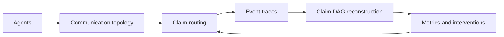

<a id="readme-top"></a>

<div align="center">

# Agent Expressional Graph

**A research lab for self-evolving LLM multi-agent graph protocols.**

Early public preview for experiments around topology-aware agent coordination,
claim-level reasoning traces, and intervention-driven self-evolution.


[What is this?](#what-is-this) |
[Status](#status) |
[Coming Soon](#coming-soon) |
[Local Preview](#local-preview)

</div>

## What is this?

Agent Expressional Graph is an experimental Python toolkit for studying how LLM
agents exchange, revise, merge, and route claims through explicit graph
structures.

The repository is currently being prepared for a cleaner public release. The
core direction is to make multi-agent coordination observable as structured
traces rather than only final answers.



## Status

> [!NOTE]
> This repository is in a coming-soon state. Interfaces, examples, and paper
> mapping notes may still change while the public package is being cleaned up.

The current codebase includes scaffolding for:

- topology-aware multi-agent communication
- claim DAG and cascade reconstruction
- reinforced routing experiments
- Deficit-Triggered Integration style interventions
- trace logging and analysis utilities
- runnable demos for local smoke testing

## Coming Soon

Planned public-release work:

| Area | Planned update |
|------|----------------|
| Documentation | Clean quickstart, architecture notes, and paper-to-code mapping |
| Examples | Minimal demos with reproducible outputs and smaller default runs |
| Experiments | Curated configs for topology and intervention comparisons |
| Analysis | Metrics helpers for cascades, contribution concentration, and routing effects |
| Packaging | Stable install path, license file, and release hygiene |

## Local Preview

Python 3.11 or newer is required.

```bash
python -m venv .venv
source .venv/bin/activate
pip install -e ".[dev]"
pytest
```

Run the minimal demo:

```bash
python examples/run_demo.py
```

Optional analysis dependencies:

```bash
pip install -e ".[analysis]"
```

<details>
<summary><b>Repository areas</b></summary>

```text
src/agents/          Agent state and mock agent behavior
src/topology/        Communication topology implementations
src/routing/         Claim visibility and routing policies
src/reconstruction/  Claim DAG and cascade reconstruction
src/interventions/   Deficit-triggered coordination interventions
src/simulation/      Workflow orchestration
src/analysis/        Metrics and analysis helpers
src/tracing/         Append-only runtime traces
examples/            Runnable local demos
tests/               Pytest coverage for core behavior
docs/                Design notes and paper mapping drafts
```

</details>

