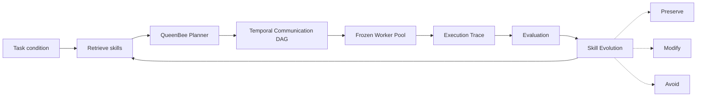

<a id="readme-top"></a>

<div align="center">

# QueenBee Planner

**A research lab for self-evolving LLM multi-agent communication topologies.**

Early public preview for experiments around skill-evolving graph generation,
token-efficient agent coordination, and evidence-grounded communication design.


[What is this?](#what-is-this) |
[Status](#status) |
[Coming Soon](#coming-soon) |
[Local Preview](#local-preview)

</div>

## What is this?

QueenBee Planner is an experimental Python toolkit for studying how LLM
multi-agent systems can learn to design their own communication structures.

Instead of improving the worker agents themselves, QueenBee freezes the worker
pool and lets an outer planner generate **temporal communication DAGs**: who sends
information to whom, in which round, who merges messages, and who produces the
final answer.

The core research question is:

> Can communication topology become a reusable, self-improving design skill?

QueenBee treats past execution traces as evidence. Successful and failed graph
patterns are distilled into planner skills with three actions:

* **Preserve** — keep a verified communication scaffold
* **Modify** — adapt a useful structure to a related task
* **Avoid** — block structures that caused coverage loss, excessive fan-in, or high cost



## Status

> [!NOTE]
> This repository is currently in a coming-soon state. Interfaces, examples,
> configs, and paper-to-code mapping notes may still change while the public
> package is being cleaned up.

The current research direction includes scaffolding for:

* LLM multi-agent communication graph generation
* temporal DAG execution with frozen worker agents
* topology-aware message routing and merge behavior
* trace logging for graph execution and evaluation
* skill-bank construction from prior graph evidence
* Preserve / Modify / Avoid design-rule distillation
* held-out acceptance gates for disciplined self-evolution
* motif-level credit assignment and structural deduplication
* experiments on Count-Frequency and Silo-style coordination tasks

## Coming Soon

Planned public-release work:

| Area          | Planned update                                                               |
| ------------- | ---------------------------------------------------------------------------- |
| Documentation | Clean quickstart, architecture notes, and paper-to-code mapping              |
| Examples      | Minimal local demos with small reproducible runs                             |
| Planner       | Public graph-generation interface and candidate validation utilities         |
| Execution     | Temporal DAG runner with frozen worker pools                                 |
| Skills        | Skill-bank format for Preserve / Modify / Avoid graph-design rules           |
| Experiments   | Curated configs for topology, cost, and evolution comparisons                |
| Analysis      | Metrics helpers for RMSE, exact match, messages, model calls, and token cost |
| Packaging     | Stable install path, license file, and release hygiene                       |

## Local Preview

Python 3.11 or newer is recommended.

```bash
python -m venv .venv
source .venv/bin/activate
pip install -e ".[dev]"
pytest
```

Run the minimal demo:

```bash
python examples/run_demo.py
```

Optional analysis dependencies:

```bash
pip install -e ".[analysis]"
```

<details>
<summary><b>Repository areas</b></summary>

```text
src/planner/         QueenBee planner and graph-generation interfaces
src/skills/          Skill bank, retrieval, and Preserve/Modify/Avoid rules
src/topology/        Temporal communication DAG specs and validation
src/execution/       Frozen-worker DAG execution runtime
src/agents/          Worker state, mock agents, and local solver wrappers
src/routing/         Message routing, inbox construction, and merge policies
src/evolution/       Evidence distillation, held-out gates, and skill updates
src/analysis/        Metrics, cost accounting, and trace analysis helpers
src/tracing/         Append-only execution traces and structured logs
examples/            Runnable local demos
tests/               Pytest coverage for core behavior
docs/                Design notes and paper-to-code mapping drafts
```

</details>

## Research Direction

QueenBee Planner explores the idea that the architecture of a multi-agent system
is not merely an implementation detail. Communication structure affects which
local evidence is preserved, which errors are amplified, how much information
reaches the final answer holder, and how much token cost the system spends.

The long-term goal is to build an agentic planner that accumulates reusable
architectural memory across runs, so future systems can generate better
communication protocols instead of relying only on hand-designed fixed
topologies.

## Citation

Citation information will be added after the paper and public package are ready
for release.
